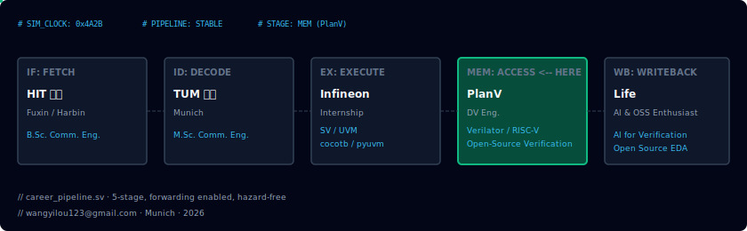
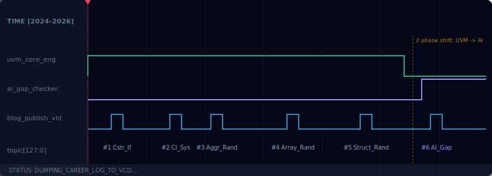

<div align="center">
  
</div>

# 王译楼 · Yilou Wang 👋

> **DV Eng. @ PlanV · TUM M.Sc. · AI & Open-Source Verification Enthusiast**

<p>
  
  
  
</p>

```systemverilog
module Yilou_Wang_Career (
  input  logic        clk,
  input  logic        rst_n,
  output logic [31:0] career_impact
);

  // IF: Harbin Institute of Technology — B.Sc. EE
  localparam string IF_STAGE = "HIT · Logic design foundation";

  // ID: Technical University of Munich — M.Sc. EE
  localparam string ID_STAGE = "TUM · Advanced digital systems";

  // EX: Infineon Technologies — Internship
  localparam string EX_STAGE = "Infineon · SV / UVM / cocotb / pyuvm";

  // MEM: PlanV — current role (active stage)
  localparam string MEM_STAGE = "PlanV · Verilator / RISC-V / Open-Source DV";

  // WB: Life & community
  localparam string WB_STAGE = "AI for Hardware · OSS · Verilator contributor";

  always_ff @(posedge clk or negedge rst_n) begin
    if (!rst_n) career_impact <= 32'h0;
    else        career_impact <= career_impact + 32'd1;  // keep shipping
  end

endmodule
```

---

## Journey

- 🎓 2017–2021: 🇨🇳 B.Eng. EE (Fuxin 🚄 Harbin)
- 🎓 2021–2024: 🇩🇪 M.Sc. EE @ TUM (China ✈️ Munich)
- 🧪 Internship: NeuSoft & Infineon
- 💼 2024–now: DV Engineer @ PlanV

---

## Original Projects

### 🎠 [badai_cardsmith-oss](https://github.com/YilouWang/badai_cardsmith-oss)
中文创作者轮播图引擎。把选题文案变成可渲染配置，并跑质量评分闭环。

### 🧰 [Toy4Joy_DV](https://github.com/YilouWang/Toy4Joy_DV)
DV playground for SV / UVM / Verilator / cocotb. Practical examples for onboarding and quick experiments.

---

## Contributions & Forks

- 🚀 [verilator](https://github.com/YilouWang/verilator) — contribution-aligned work fork.
- 🧪 [PlanV_Verilator_Feature_Tests](https://github.com/YilouWang/PlanV_Verilator_Feature_Tests) — feature validation flow at work.
- 📘 [MS_Thesis_cocotb-BSHL](https://github.com/YilouWang/MS_Thesis_cocotb-BSHL) — thesis implementation repo.

---

## Publications

- 📄 **Advancing Open-Source Verification: Enabling Full Randomization in Verilator** — DVcon Europe 2025 · Oct 15, 2025
- 📄 **Enable Reuse of SystemVerilog Verification IPs in cocotb/pyuvm** — DVcon Europe 2024 · Oct 16, 2024

---

## 📝 Simulation Logs (Latest Posts)

<div align="center">
  
</div>

- **#1** · 2024.08 · [UVM in Verilator: Constraint random if/else](https://planv.tech/2024/08/02/enabling-uvm-support-in-verilator-series-part-1-constraint-random-ifelse-constraint-support/)
- **#2** · 2024.10 · [UVM in Verilator: CI system and test models](https://planv.tech/2024/10/08/enabling-uvm-support-in-verilator-series-our-ci-system-and-test-models/)
- **#3** · 2024.11 · [UVM in Verilator: Aggregate data type randomization](https://planv.tech/2024/11/07/enabling-uvm-support-in-verilator-series-basic-randomization-support-for-aggregate-data-types/)
- **#4** · 2025.02 · [UVM in Verilator: Array constrained randomization](https://planv.tech/2025/02/07/enabling-uvm-support-in-verilator-series-constrained-randomization-support-for-all-types-of-arrays/)
- **#5** · 2025.07 · [UVM in Verilator: Struct constrained randomization](https://planv.tech/2025/07/04/enabling-uvm-support-in-verilator-series-constrained-randomization-support-for-structs/)
- **#6** · 2026.02 · 🤖 [Verilator Gap Checker with AI](https://planv.tech/2026/02/24/verilator-gap-checker-automatically-detecting-feature-gaps-in-verilator-with-ai/)

---

## Currently Building (Private)

- 🧠 `badai_cardsmith` — 中文创作生产版（更多模板/系列）
- 📚 `ai-memoir` — AI 回忆录系统（采访到交付）
- 📝 `story_engine` — 中文故事引擎（主题到剧情）
- 🎯 `interview_helper` — DV interview prep workflow

---

## Contact

<p>
  <a href="https://www.linkedin.com/in/yilou-wang-a0569b215/">
    
  </a>
</p>

- Email: [wangyilou123@gmail.com](mailto:wangyilou123@gmail.com)
